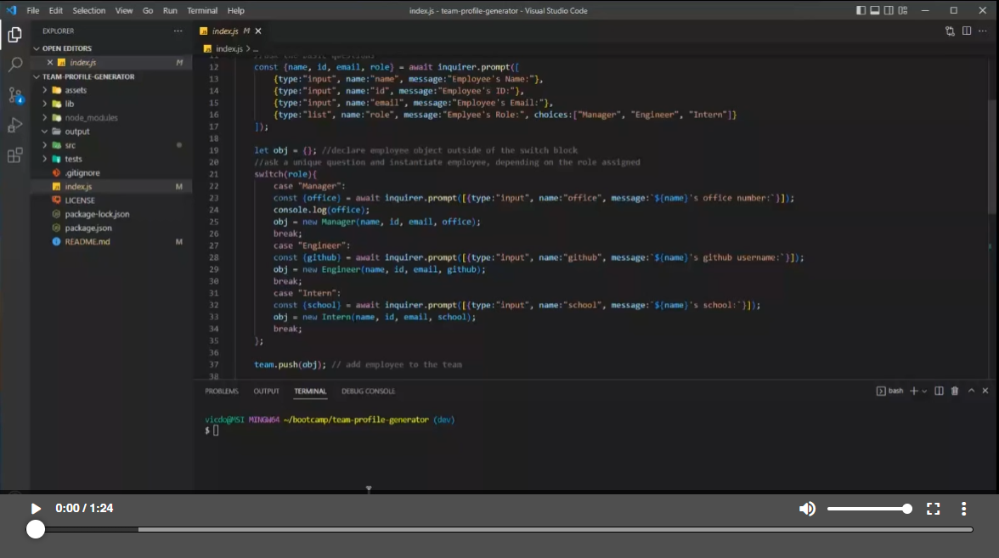

# Team Profile Generator


## Description
A Node.js command-line application that takes in information about employees on a software engineering team, then generates an HTML webpage that displays summaries for each person.

## Table of Contents
* [Installation](#installation)
* [Usage](#usage)
* [Contributing](#contributing)
* [Tests](#tests)
* [License](#license)
* [Questions](#questions)

## Installation
Open the directory in terminal and run:
```
node install
node index.js
```

## Usage
The application will begin prompting the user for questions about their team members. Upon completion, a 'team.html' will be generated in the 'output' directory.

[](https://watch.screencastify.com/v/pNE5UFp1r14PDiBY3OfP)

## Contributing
Contributions are welcome. You can contact me through the information below.

## Tests
There is a [sample-team.html](/output/sample-README.md) file in the output directory. 

## License
The Team Profile Generator project is under the [MIT License](http://choosealicense.com/licenses/mit/). See the link for more details.

## Questions
GitHub: [vicdotexe](https://www.github.com/vicdotexe)

E-mail: [vicdotexe@gmail.com](mailto:vicdotexe@gmail.com)
